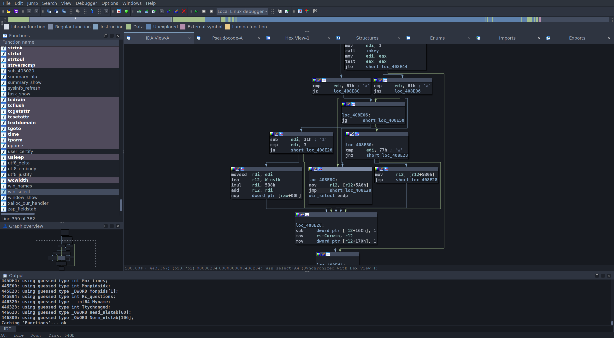
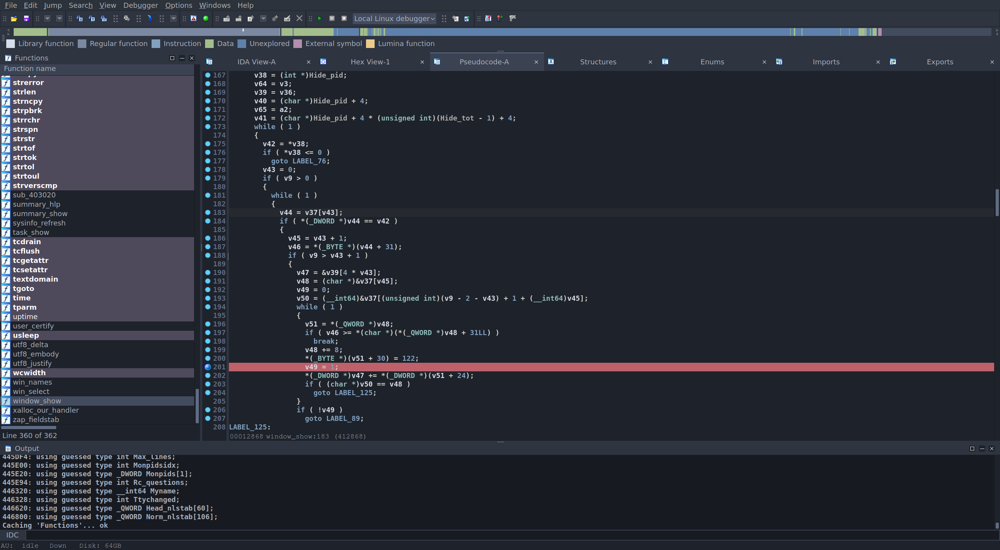
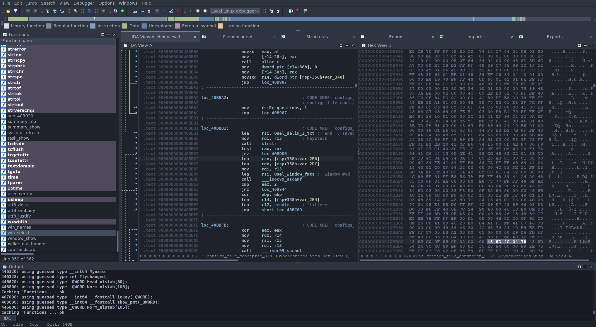

# IDA - Nord

A dark [Nord theme](https://www.nordtheme.com/) port for [Hex Rays IDA](https://hex-rays.com/ida-pro/).

## Screenshots

## Installation

1. Clone the theme:

       $ git clone https://github.com/endofunky/ida-nord-theme.git ~/.idapro/themes/nord

2. Open IDA

3. Go to `Options` > `Colors`

4. Select `nord` from the `Current theme` dropdown menu

## Acknowledgements

- Based on [IDA Nightfall](https://github.com/0xItx/ida_nightfall) by [@0xItx](https://github.com/0xItx)
